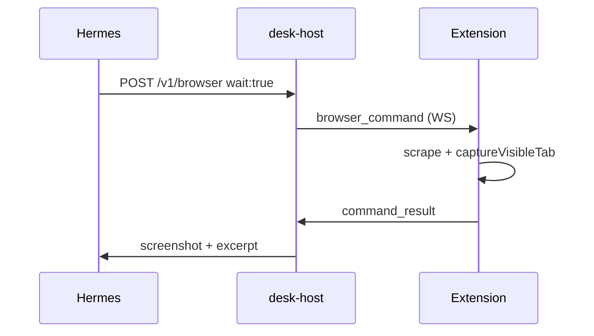

# Hermes setup for Virgil Desk

Wire Hermes as the agent backend for live handoff decompose and browser tools.

## 1. Profile and skills

```bash
hermes profile use virgil-executor   # or your profile name
```

Add this repo's skills directory to Hermes config (`~/.hermes/profiles/<profile>/config.yaml`):

```bash
./scripts/print-hermes-snippet.sh
```

Paste the printed `skills.external_dirs` entry into your profile config.

Enable the **`desk-browser-bridge`** skill in `hermes tools` (or profile config).

## 2. Host environment

```bash
export DESK_AGENT_BACKEND=hermes
export DESK_HERMES_PROFILE=virgil-executor
export DESK_HERMES_HOME=~/.hermes/profiles/virgil-executor
# Optional: force stub decompose for debugging
# export DESK_HERMES_DECOMPOSE=0
desk-host
```

Load the extension (unpacked `packages/extension/dist`). Hand off a tab — the panel **Decomposition** line should reflect Hermes output (not generic stub titles when CLI succeeds).

## 3. Browser tool flow



Example:

```bash
curl -s -X POST http://127.0.0.1:8787/v1/browser \
  -H 'Content-Type: application/json' \
  -d '{
    "run_id": "desk_example",
    "op": "scrape",
    "human_tab_id": 1,
    "tab_id": 2,
    "wait": true
  }'
```

Requires the extension connected over WebSocket (`WS connected` in the panel status strip).

## 4. Manual decompose checklist

1. `DESK_AGENT_BACKEND=hermes desk-host`
2. Open a real page (job listing, article, inbox thread)
3. Hand off with optional intent text
4. Confirm board titles match page content (not `Hermes: <title>` stub)
5. `desk-events --run-id <id>` shows `handoff.decomposed` with `"live": true`

## Troubleshooting

| Symptom | Fix |
|---------|-----|
| Stub titles (`Hermes: …`) | Hermes CLI missing, timeout, or invalid JSON — check `hermes chat --json` manually |
| `WS disconnected` | Host not running or wrong URL in extension options |
| `screenshot_cap` | >20 screenshot ops this run — see [`LIMITS.md`](LIMITS.md) |
| Browser 403 | Extension not connected; command blocked by tab policy |
