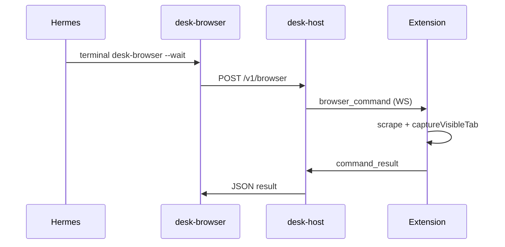

# Hermes setup for Virgil Desk

Wire Hermes as the agent backend for live handoff decompose, **Run agent** execute, and browser tools.

## 1. Profile and skills

```bash
hermes profile use <your-profile>   # local default often virgil-executor
```

Add this repo's skills directory to Hermes config (`~/.hermes/profiles/<profile>/config.yaml`):

```bash
./scripts/print-hermes-snippet.sh
```

Paste the printed `skills.external_dirs` entry into your profile config.

In **`hermes tools`** (or profile config):

- Enable **`terminal`** toolset (for `desk-browser` CLI)
- Enable **`desk-browser-bridge`** skill

Add repo `scripts/` to PATH (or invoke with full path):

```bash
export PATH="$PWD/scripts:$PATH"
```

## 2. Host environment

```bash
export DESK_AGENT_BACKEND=hermes
export DESK_HERMES_PROFILE=<your-profile>   # local default often virgil-executor
export DESK_HERMES_HOME=~/.hermes/profiles/<your-profile>
export DESK_HOST=127.0.0.1
export DESK_PORT=8787
# Optional: force stub decompose for debugging
# export DESK_HERMES_DECOMPOSE=0
desk-host
```

Load the extension (unpacked `packages/extension/dist`). Hand off a tab — the panel **Decomposition** line should reflect Hermes output (not generic stub titles when CLI succeeds).

## 3. Browser tool flow



Example (Hermes or shell):

```bash
desk-browser --run-id desk_example --op scrape --human-tab-id 1 --tab-id 2 --wait
```

Requires the extension connected over WebSocket (`WS connected` in the panel status strip).

## 4. Run agent (manual execute)

1. Hand off a page → board populates Agent column
2. Click **Run agent** on an Agent item
3. Host calls Hermes with `execute_agent_item` prompt + `desk-browser-bridge` skill
4. Hermes invokes `desk-browser` → extension executes on **agent tab**
5. Item moves to **done** on success

Query events:

```bash
desk-events --run-id <id> --summary
```

Expect `agent.execute_started`, `browser.command`, `browser.command_result`, `agent.executed`.

## 5. Manual decompose checklist

1. `DESK_AGENT_BACKEND=hermes desk-host`
2. Open a real page (job listing, article, inbox thread)
3. Hand off with intent chips (**All visible** / **This item**) and optional detail text
4. Confirm board titles match page content (not `Hermes: <title>` stub)
5. `desk-events --run-id <id>` shows `handoff.decomposed` with `"live": true`
6. `handoff.snapshot` shows `flags.has_screenshot: true` when extension captured PNG

See also [`tests/manual/hermes_execute_checklist.md`](../tests/manual/hermes_execute_checklist.md).

## Troubleshooting

| Symptom | Fix |
|---------|-----|
| Stub titles (`Hermes: …`) | Hermes CLI missing, timeout, or invalid JSON — check `hermes chat -Q -q "…"` manually |
| `WS disconnected` | Host not running or wrong URL in extension options |
| `screenshot_cap` | >20 browser ops this run — see [`LIMITS.md`](LIMITS.md) |
| Run agent marks **done** but summary says blocked/timeout | Hermes lacked `terminal` toolset or hook approval — set `hermes.execute_toolsets` in [`config/desk.yaml`](../config/desk.yaml) |
| `Timeout — denying command` in evidence | Same — host now fails execute when summary reports blocked tools (`execute_accept_hooks: true`) |
| Run agent 501 | Backend lacks `execute_item` — use a backend that implements it (`hermes`, `mock`; OpenClaw stub delegates to mock) |
| `desk-browser` not found | Add repo `scripts/` to PATH or use absolute path |
